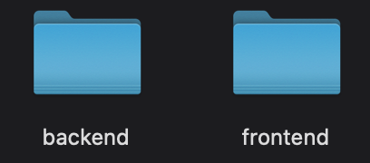
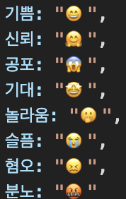
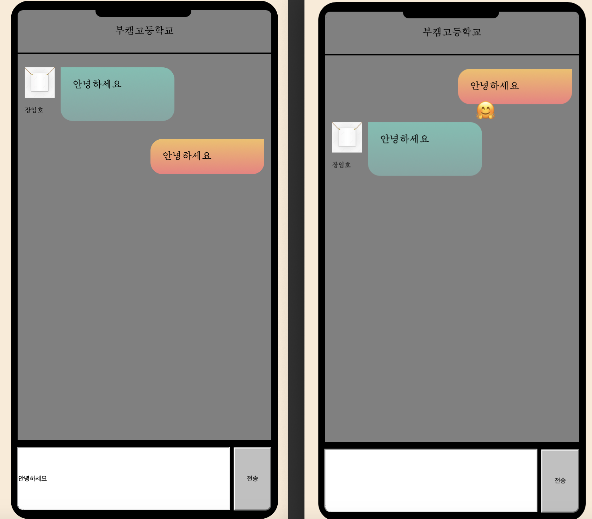
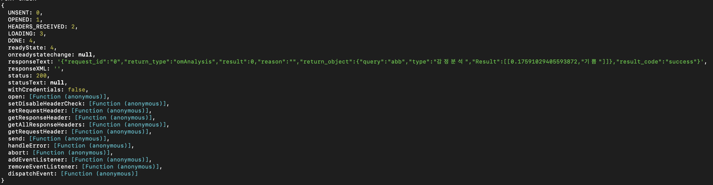
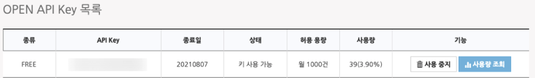
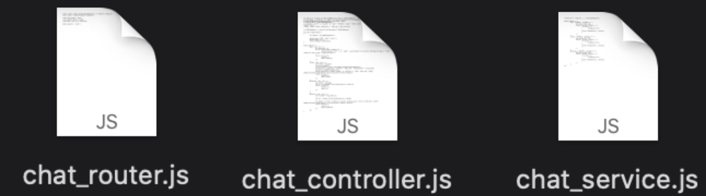

## 모아라떼 2주차 A 기능 구현 - 회의록 2020년 8월 7일

A 기능: 채팅 내용을 보고 사용자의 감정을 분석

> 참여자

- J035 김민성
- J141 이상희
- J147 이소정
- J179 전병재
- J219 황병헌
- S012 김영렬
- S024 설민주
- S035 유시형
- S046 장임호
- S057 조정래 

---------------
### Languages Available

|참여자|Language|
|------|------|
|J035 김민성|Python|
|J141 이상희|ReactJS, NodeJS, Flask, Python|
|J147 이소정|React|
|J179 전병재|Python, React, NodeJS|
|J219 황병헌|NodeJS, ExpressJS|
|S012 김영렬|NuxtJS, NodeJS|
|S024 설민주|Java, C++, Python|
|S035 유시형|C++, Python|
|S046 장임호|Frontend|
|S057 조정래|Python, Django, Flask|

-----------
> Platform 선택

각자의 사용가능한 언어를 토대로 [웹] 을 선택하게 되었습니다.

> 역할 분담

Frontend와 Backend 역할을 분리하여 시행하였습니다.


- Frontend

    J035 김민성, J147 이소정, S024 설민주, S046 장임호, S057 조정래

- Backend

    J141 이상희, J179 전병재, J219 황병헌, S012 김영렬, S035 유시형
-------------
> 2주차 구현내용

- 회원가입 제외 (로그인 없이 - 바로 채팅창으로 연결)
- 채팅입력 화면
- 채팅 말풍선에 커서를 올릴 시 감정 분석

> 진행 방식

- Frontend와 Backend끼리 두개의 회의실로 나눠 30분씩 토론 후, 다시 모여 얘기한 내용 공유
- Frontend는 React 라이브러리를 사용하기 보다 접근성이 높은 바닐라JS로 구현하기로 결정
- Backend는 Node.js를 이용하여 Rest API 서버를 제작하기로 결정

> 30분 후 회의내용

- 서버 및 데이터베이스 필요성
    - A기능까지의 구현에서는 Ncloud서버와 Database의 필요성이 충분하지 않아 Local 상에서 배열을 통해 작동할 수 있도록 구현
    - 하지만 다음 relay 참여자들을 위해 Backend에서 서버 및 데이터베이스 설계 제작
- Frontend에서 API를 받아 진행해도 되는 기능들 정리

> 구현 목표

- Frontend
    - API를 받아 채팅에 해당 정보를 출력 및 등록 기능을 해줄 수 있도록 합니다. 
    - 채팅 말풍선에 커서를 올릴 시, 감정 상태를 tool-tip으로 보여줍니다.
- Backend
    - 채팅의 전체리스트를 가져올 때 감정상태 및 이미지까지 가져올 수 있도록 합니다.
    - 다음 기능 구현 과정을 위해 서버 - Database 연결 구성을 제작해줍니다.

> Frontend Chatting UI 구성

- UI
    - 채팅방 UI
    - 채팅 상대 이름 및 기분
    - 상대방 채팅을 보여줄 UI
        - 프로필 사진
        - 말풍선
    - 내 채팅을 보여주는 UI
        - 말풍선
- 기능
    - socket.io 연결 구성
      - Text
    - Server API로 요청 보내고 받아서 처리
      - 상대방 이름
      - 감정 상태

      
      - 채팅 Text

      


> Backend Chatting 구성

- 기능
    - 채팅 등록 시, API를 통해 감정 분석을 하여 데이터 저장

      

      <https://www.adams.ai/apiPage;jsessionid=90EE2616E6296880ABD54DE3C820DE7A?OMAnalysis>
      - 해당 기능을 이용하려면 API 키를 새로 발급해야합니다. 위의 주소에서 로그인 후, API 키를 발급하여 사용하시변 됩니다.
      
      
    - 전체 리스트에 메세지와 함께 해당되는 유저 이미지와 감정 상태를 보내주는 API
    - Database 연결 과정 구현
        - config/data.js 내에 자신의 데이터베이스 주소를 적으면 연결됩니다.
        - service, controller, router를 나눠 제작, service에 sql 쿼리 작성

        

    - Frontend와 얘기를 나눠 JSON 형식을 맞춰 제작

        ```swift
        /api/chat/:id {
          "success": 1,
        	"data": {
            "id" : 1,
            "userid": 3,
            "chat": "안녕하세요",
            "mind": 신뢰
        	}
        }
        ```
